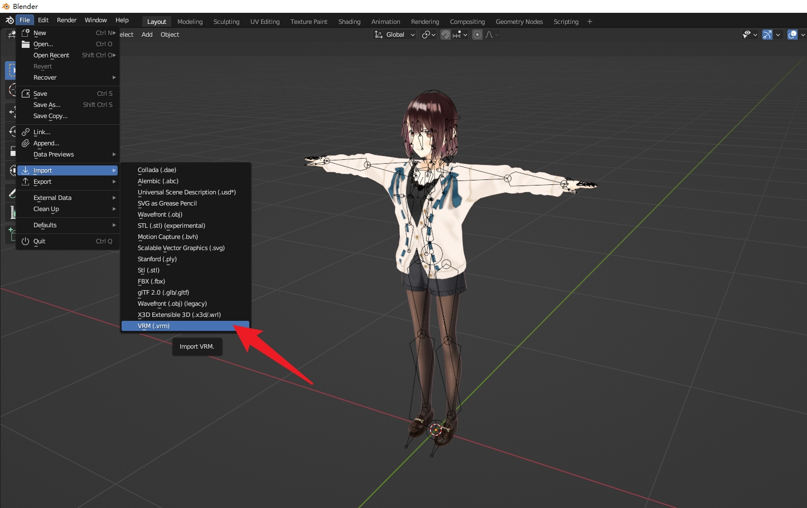
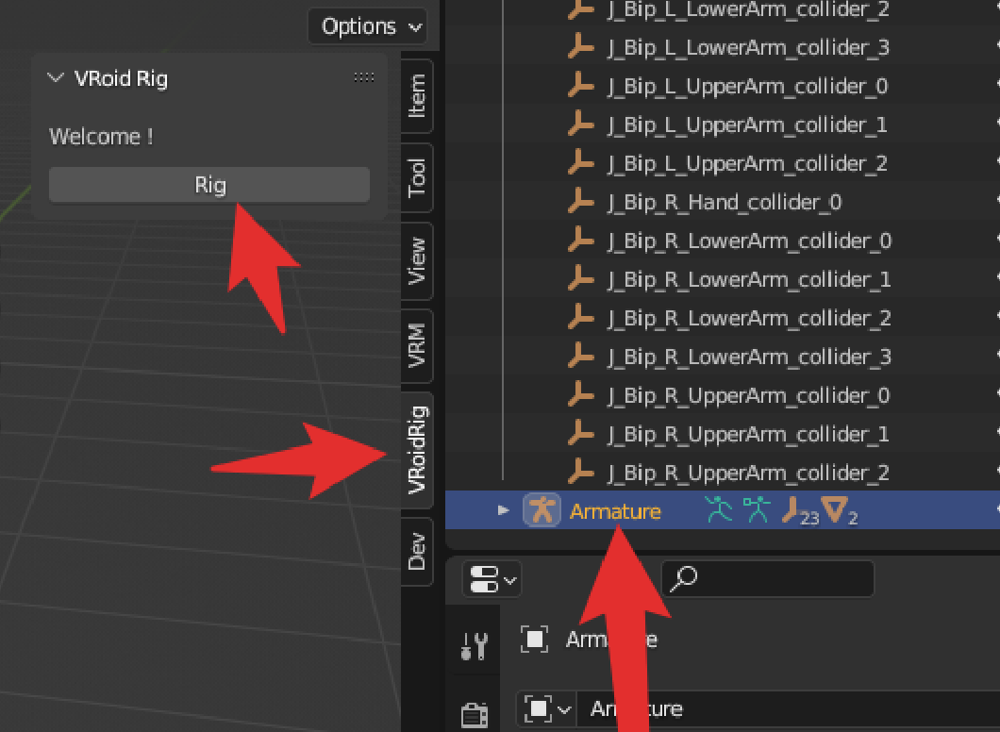
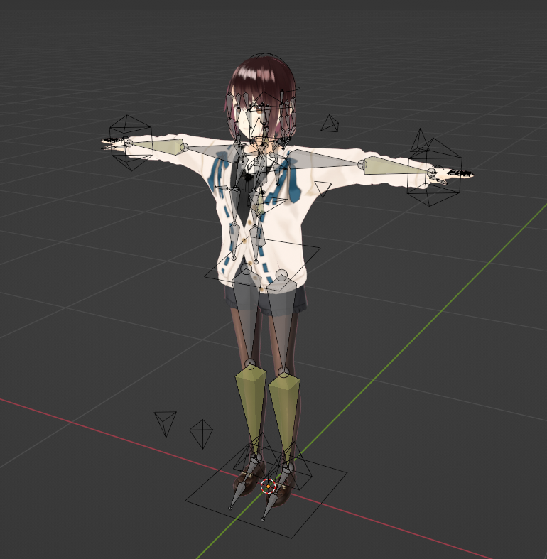

# VRoidRig
Blender VRoid Rig Addon
# install
1. Download this blender addon https://github.com/PMZeroSkyline/VRoidRig/releases/
   
2. Open blender
  - Edit > Preferences > Add-Ons
  - Click “Install…” button in the top right of the window
  - Find the Add-On file to install
  - Click “Install Add-on”
# Import VRM
1. Download and install VRM-Addon-for-Blender addon. https://github.com/saturday06/VRM-Addon-for-Blender
2. Import vrm model

# Use
1. Select Armature click Rig button in VRoidRig view 3d panel.

2. Done!

